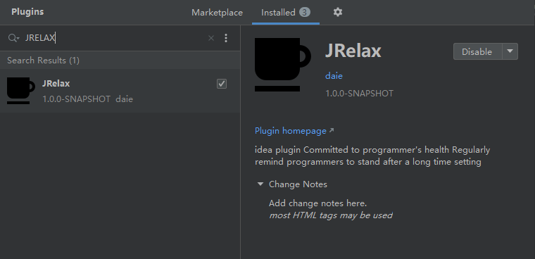
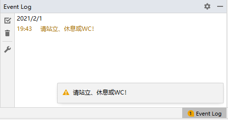

# JRelax
idea plugin Committed to programmer's health

Regularly remind programmers to stand after a long time setting

The following features are available: 

- Add bubble standing prompt in lower right corner

# Install
## Option 1
Search 'JRelax' in Idea plugins repository.

## Option 2

Download [Releases](https://github.com/HappyDale/JRelax/releases/tag/1.0.1)

# Usage
File->Setting->Other Settings->JRelax Settings

notes：TimeGap between 0~7200(s) is reasonable

# Result

